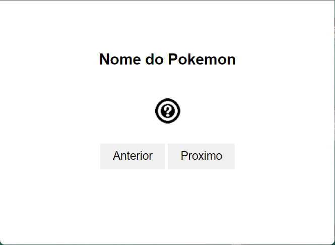
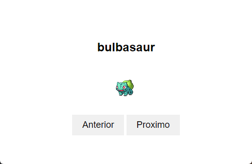

# Aprendendo como utilizar um serviço de API

# Desafio Pokedex utilizando pokeapi.co



Neste desafio você irá terminar de implementar o funcionamento da Pokedex utilizando o serviço pokeapi.co para conseguir as informações e imagens dos Pokémons. A Pokedex começará mostrando o primeiro pokémon com seu nome e imagem, ao usuário clicar nos botões "anterior" e "próximo" ele irá mudar o Pokémon mostrado e irá navegar na lista de Pokémons fornecidos pela api pokeapi. Quando o usuário clicar no botão anterior estando no primeiro Pokémon, ele irá para o último Pokémon. E se ele estiver no último e clicar em próximo, o contrário acontecerá, ele irá retornar para o primeiro.



Caso surjam dúvidas, você pode utilizar o canal da capacitação no slack, contatar algum membro ou conversar com seu squad.

Na EngNet utilizamos uma ferramenta personalizada do ChatGPT para aprendizado e melhor rendimento no desenvolvimento dos projetos, chamada de ZillaGPT. Você pode utilizar o ZillaGPT como seu professor particular para consultar informações técnicas sobre o javascript. [https://zillagpt.engnetconsultoria.com.br/](https://zillagpt.engnetconsultoria.com.br/)

### Entrega

- Você deve realizar um fork deste repositório para sua conta pessoal no GitHub. A entrega só será considerada válida se estiver incluída em uma release no seu novo repositório no GitHub. Se o candidato não souber como realizar um Fork, Commit, Push e uma Release no GitHub, deverá pesquisar ou pedir ajuda. O desafio também avaliará sua independência.

- Após fazer a release do seu repositório enviei o arquivo zip da release para o Google Classroom

- Você não deve excluir o repositório e nem a release após a entrega, pois a utilização do GitHub será avaliada.

### PokeApi

#### [Link da documentação do pokeapi.co](https://pokeapi.co/docs/v2)

Você poderá utilizar a seguinte url da api para pegar a lista de todos os pokémons:

```
https://pokeapi.co/api/v2/pokemon/?offset=0&limit=1292
```

Para pegar as informações do Pokémon atual utilize o seguinte endereço de url da api:

```
https://pokeapi.co/api/v2/pokemon/nome_do_pokemon

ou

https://pokeapi.co/api/v2/pokemon/numero_do_pokemon_apartir_do_numero_um
```

O parâmetro "offset" define a partir de qual pokémon começará a lista(array) de pokémons que deseja receber. Já o parâmetro "limit" define até qual número de pokémon você irá receber nessa lista. Esses parâmetros foram criados com o objetivo de reduzir o consumo de dados ao carregar uma grande quantidade de informações. Como a quantidade de pokémons máxima de 1292 é considerada pequena para quantidade de processamento do computador e velocidade da rede. Não é considerado um problema carregar todos os pokémons de uma vez nesse caso. No entanto, em uma situação em que houvesse um milhão de pokémons, isso poderia se tornar um problema. Se você não utilizar os parâmetros "offset" e "limit" a api "https://pokeapi.co/api/v2/pokemon/" irá retornar somente 20 pokémons por padrão, o que é uma quantidade muito pequena para esse desafio. Esse recurso de limitar o número de resultados em uma api se chama paginação ou pagination.

### Imagem do Pokémon

Para a imagem do Pokémon você utilizará o seguinte atributo fornecido pelo resultado da api para o pokémon especifico:

```
{
 "sprites": {
    "front_default": "https://raw.githubusercontent.com/PokeAPI/sprites/master/sprites/pokemon/X.png",
 }
}
```

#### [Exemplo de resultados da API](assets/exemplo.md)

### Async/Await

Para conseguir fazer esse desafio você precisa aprender como funciona o modo assíncrono do javascript. Como criar uma função assíncrona e utilizar o await.

[Mario Souto explicando Async e Await](https://www.youtube.com/watch?v=q28lfkBd9F4)

#### [Link da documentação do Async no w3schools](https://www.w3schools.com/js/js_async.asp)

#### [Link da documentação do Async da Mozilla](https://developer.mozilla.org/pt-BR/docs/Web/JavaScript/Reference/Statements/async_function)

### Fetch

Para conseguir utilizar a api você pode utilizar a função fetch nativa do Javascript.

#### [Vídeo de como usar o fetch](https://www.youtube.com/watch?v=m3K8DP4kVXQ&t=1s)

#### [Link da documentação do Fetch API no w3schools](https://www.w3schools.com/jsref/api_fetch.asp)

#### [Link da documentação do Fetch API da Mozilla](https://developer.mozilla.org/pt-BR/docs/Web/API/Fetch_API)

#### [Tutorial do Fetch API Devmedia](https://www.devmedia.com.br/javascript-fetch/41206)

Também será necessário utilizar o Response.json() para converter os dados fornecido pela api para objeto javascript.

#### [Vídeo explicando .json()](https://www.youtube.com/watch?v=PmDtOBtZzhQ)

#### [Link da documentação do Response.json() da Mozilla](https://developer.mozilla.org/en-US/docs/Web/API/Response/json)

O JSON.parse() é outra forma de converter os dados da api em JSON para objeto javascript, no caso ele converter uma string em sintaxe JSON para objeto javascript, diferentemente do "Response".json() que converte a resposta da api diretamente para objeto javascript.

#### [Vídeo explicando JSON.parse()](https://www.youtube.com/watch?v=cq5oTRH5_ZM)

#### [Link da documentação do JSON.parse() no w3schools](https://www.w3schools.com/js/js_json_parse.asp)

### Sugestões de extensões para o Visual Studio Code

- Live Server - permite visualizar o arquivo html atualizando automaticamente toda vez que uma alteração for salva

### Material complementar

#### [O que é uma api](https://youtu.be/PIro1he52Xw?t=101)

### Desafio extra opcional

Complemente a sua pokedex com mais informações sobre o Pokémon e deixe a interface mais bonita.
